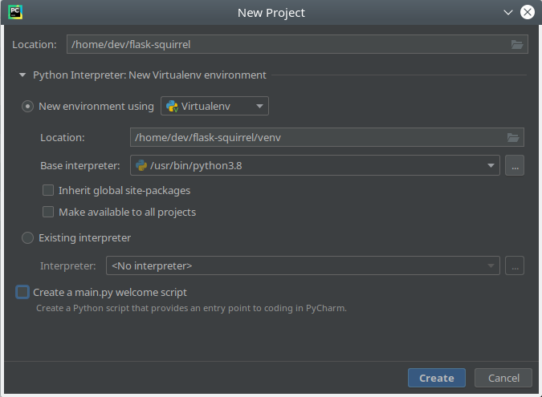
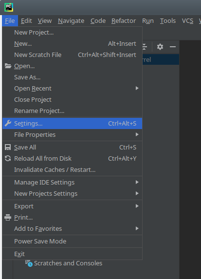
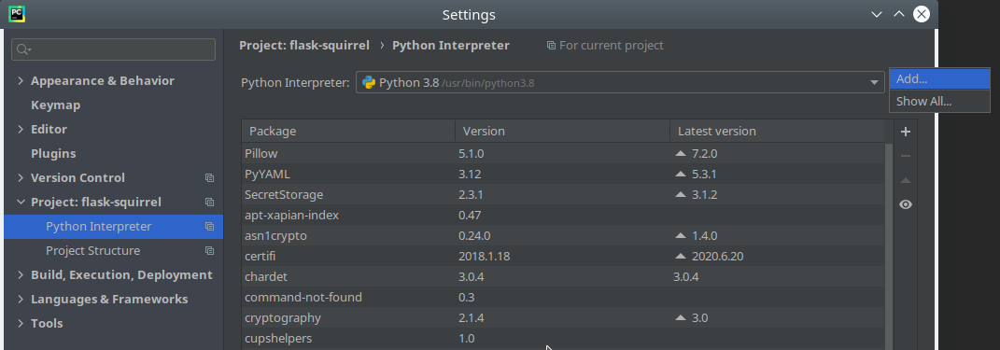
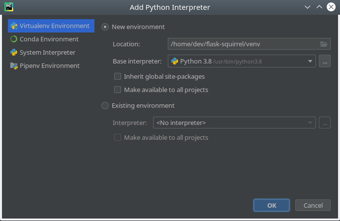
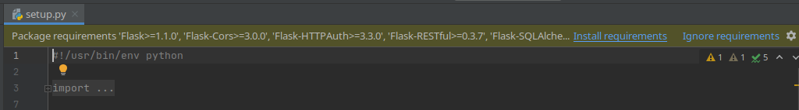
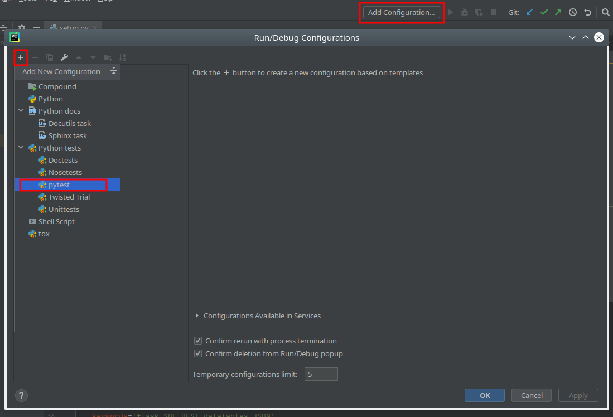
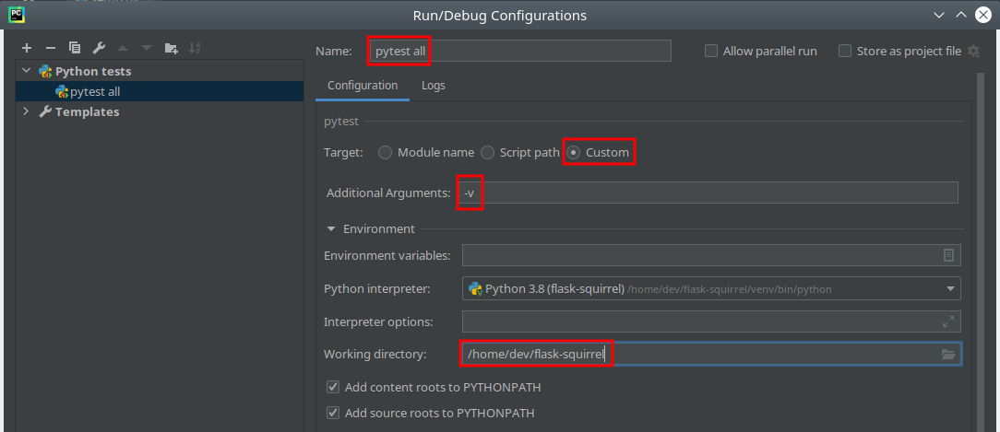
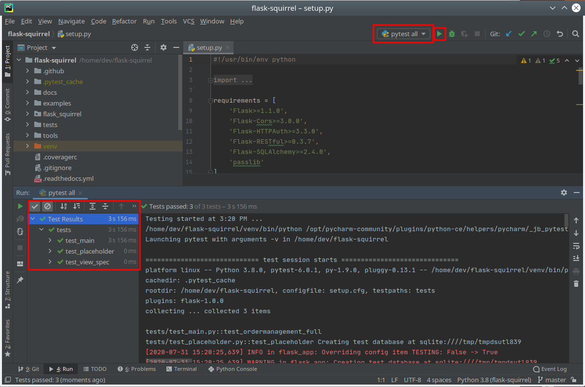
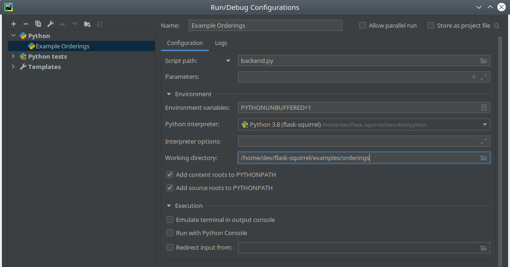
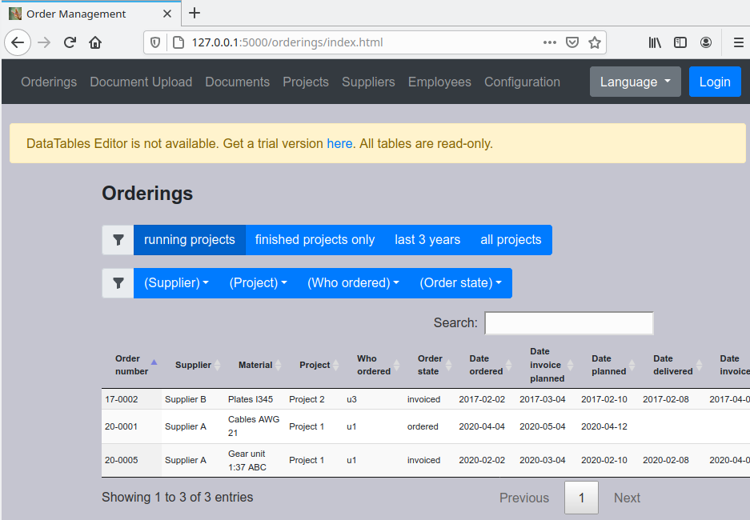

PyCharm Dev Setup
=================

Here you learn how you could debug or extend Flask-Squirrel using the very good IDE JetBrains PyCharm.

Base Setup
----------

First make sure you have cloned the git repo to your developer's project directory.

- Choose "New Project" in the startup dialog.
- Select the flask-squirrel checkout path
- Specify the "venv" directory for the virtual environment
- Do NOT create a main.py script

- Say "yes" to create a project from existing source (dialog)
- go to the "Settings" menu

- go to "Project: flask-squirrel" > Python interpreter
- click the gear button on the right side, select "Add..."

- accept default "Virtual Environment" and "venv" path in project directory

- press "ok" to accept the new settings
- a new venv will be created
- open any Python file in the editor
- a popup message box appears saying that the requirements are not installed yet

- click on "Install Requirements" and select all dependencies

pytest Target
-------------

To run the pytests do the following steps:

- Create a new run configuration with the button on the top-right
- On the "add" button select "pytest" 

- Name it "pytest all"
- Select "Custom" target
- Additional arguments: -v
- Set the working directory to the project base path ("tests" directory will automatically searched py pytest)

- Run the tests with the "play" button

Orderings Demo
--------------

To run the "Orderings" example in PyCharm do the following steps. The description is not as detailed as above.

- Go into "Edit Configurations..."
- On the "add" button select "Python" 
- Name it "Example Orderings"
- Enter the script by hand: backend.py
- Working directory: /home/dev/flask-squirrel/examples/orderings

- Open http://127.0.0.1:5000/orderings/index.html in a browser

