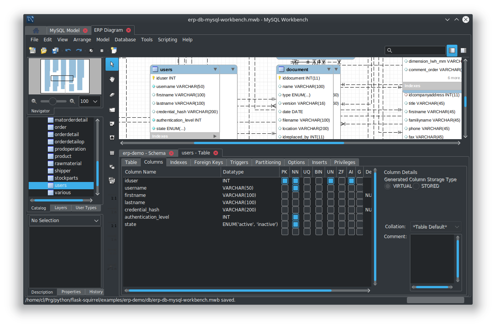
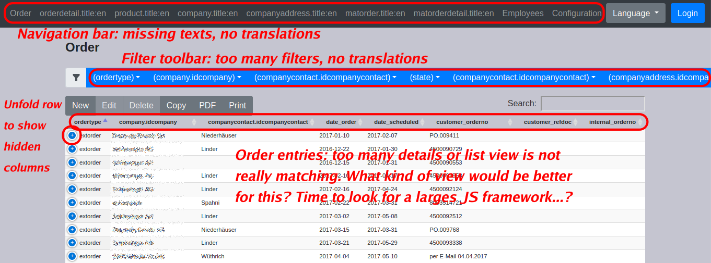

ERP Demo Project
================

This tutorial shows how to setup a more complex application like an
`ERP <https://en.wikipedia.org/wiki/Enterprise_resource_planning>`_. The SQL structure of this
demo was formerly used within a real-world Qt application. Now all the tables will be provided
as a REST API instead.

.. note::

   This demo shows:
   
   - the backend: how provide complex SQL tables via a REST API
   - a frontend: how to present all tables each in a datatables jQuery component using a
     generic UI (but which is not very suited for this complex application)
   - it also shows how to introduce your own business logic

Also note that this ERP project is a very customer specific project for a small mechanical
factory with very specific needs. So you will not be able to directly use it without
changes - and it's not complete anyway.

Prerequisites
-------------

.. note::

   This section describes how to get the database conversion and extraction tools. And maybe 
   you're new to flask-squirrel so it is easier to fetch the package and integrate it as a
   developer package where you can debug it and set breakpoints in your favorite IDE.
   
   In principle, you could also just install it with pip: :code:`pip install flask-squirrel`

So do the following steps for a developer setup - here /home/dev will be used as base directory
for this demo project.

.. code-block:: shell

   cd /home/dev
   git clone https://github.com/ClNo/flask-squirrel.git
   # this directory will later be used for a "venv" developer link (instead of pip install)

Now create the erp project:

.. code-block:: shell
   
   cd /home/dev
   mkdir erp-backend
   cd erp-backend
   python3 -m venv venv
   source venv/bin/activate
   pip install --upgrade pip
   cd ../flask-squirrel
   python setup.py develop
   cd ../erp-backend

You could check now if :code:`flask-squirrel` has been installed:

.. code-block:: shell

   python3
   import flask_squirrel
   # if you get no errors here it's installed correctly as developer setup

Re-activate Virtual Env
-----------------------

If you stop your work and later need to re-activate the Python environment do the following steps:

.. code-block:: shell
   
   cd /home/dev/erp-backend
   source venv/bin/activate
   # start your Python work here, you're in :)

SQL Table Definition
--------------------

This tutorial uses an existing database model which has been created using the graphical database
tool `MySQL Workbench <https://www.mysql.com/products/workbench/>`_.

What you will do next to give you an overview:

1. copy the MySQL Workbench project and modifiy it if you want
2. copy the SQL creation file or generate a new one
3. convert it to a SQlite file
4. extract the database structure and generate files for the backend:
   
   - databse structure JSON file
   - translation JSON file
   - custom view specification JSON file

For step 1 and 2 you could do it this way:

.. code-block::

   cd /home/dev/erp-backend
   mkdir db
   cp ../flask-squirrel/examples/erp-demo/db/erp-db-mysql-workbench.mwb db/
   cp ../flask-squirrel/examples/erp-demo/db/erp-db-mysql-workbench.sql db/
   cp ../flask-squirrel/examples/erp-demo/db/erp-db-initial-data.sql db/

If you like to modify the database open it in the MySQL Workbench, edit the tables and export the
SQL commands like this:

- Menu File > Export > Forward Engineer SQL CREATE Script...
- Output SQL Script File: :code:`/home/dev/erp-backend/db/erp-db-mysql-workbench.sql` (replace existing)
- Do not check anything, just go "> Next"
- Only check "Export MySQL Table Objects", go "> Next"
- Check the output, write the file "> Next"

For instance, the users table will look like this:

.. code-block:: sql

   -- -----------------------------------------------------
   -- Table `erp-demo`.`users`
   -- -----------------------------------------------------
   CREATE TABLE IF NOT EXISTS `erp-demo`.`users` (
     `iduser` INT UNSIGNED NOT NULL AUTO_INCREMENT,
     `username` VARCHAR(50) NOT NULL,
     `firstname` VARCHAR(100) NULL DEFAULT NULL,
     `lastname` VARCHAR(100) NULL,
     `credential_hash` VARCHAR(200) NULL DEFAULT NULL,
     `authentication_level` INT NOT NULL,
     `state` ENUM('active', 'inactive') NOT NULL,
     PRIMARY KEY (`iduser`))
   ENGINE = InnoDB
   DEFAULT CHARACTER SET = utf8;

.. warning::

   A "users" table with a username and a credential field must exist! Maybe you want to insert the
   "users" table SQL statements from the Orderings demo and insert it into your table. An initial
   admin user will be created automatically according to the erp-config.json config file.

Ok, step 1 and 2 have been done. Now we arrive at step 3 and have to convert the MySQL syntax to
SQlite as we use a single SQlite database instead of a separate server which makes it a bit
easier for this tutorial.

.. code-block:: shell
   
   cd /home/dev/erp-backend
   python ../flask-squirrel/flask_squirrel/tools/mysql_to_sqlite_convert.py db/erp-db-mysql-workbench.sql db/erp-db-sqlite.sql

Now step 1, 2 and 3 have been done so let's extract some data which is used for the backend.

Create JSON DB specification File
---------------------------------

Now we have to extract the database structure and generate a the so-called database specification file.
But we now have two SQL files:

1. the MySQL Workbench export in :code:`db/erp-db-mysql-workbench.sql`
2. the SQlite file in :code:`db/erp-db-sqlite.sql`

Which one should you use a source for the generation of the JSON file? My recommendation is to use the MySQL
Workbench Export as it is the "source of the source". In this case here it has even some advantages:
it contains some fields with the *enum* column type which will be lost in SQlite conversion as SQlite
does not know this type. The JSON file will contain those enum values and provide it to the frontend which
will give a selection list at the end.

.. code-block:: shell

   mkdir rest-config
   python ../flask-squirrel/flask_squirrel/tools/extract_dbspec.py db/erp-db-mysql-workbench.sql rest-config/db_spec.json

Create Customview JSON File
---------------------------

Now we have a list of all tables and columns/fields defined in the :code:`db_spec.json` file. But in most cases
you don't want to show each field to the user on the frontend. Or sometimes you only want to show a field
as read only which is not editable by the frontend user but will be written for instance by the business logic
in the backend.

That's why you need a configuration file called :code:`db_customview_spec.json` containing the behaviour of
the frontend.

.. note::

   For now, all tables must appear in the :code:`db_customview_spec.json` file. If it does not, an exception will appear on
   accessing every API resource. This will be fixed in the future.

Here, an initial file containing all the tables and fields will be created using a helper script:

.. code-block:: shell

   python ../flask-squirrel/flask_squirrel/tools/initial_customview_translation.py rest-config/db_spec.json rest-config/db_customview_spec.json rest-config/translation.json

The generated file :code:`db_customview_spec.json` no contains references to the foreign table and
which name should be displayed in the frontend. The Python script tries to automatically guess those
foreign key names ("ref_text"). This looks like that (just two tables shown here):

.. code-block:: json

   {
   "orderdetail": {
     "_attributes": [],
     "_predefined_filters": {},
     "idorder": { "ref_text": ["order.customer_orderno", "order.customer_refdoc"] },
     "idproduct": { "ref_text": ["product.name"] },
     "idrawmaterial": { "ref_text": ["rawmaterial.material", "rawmaterial.dimension"] }
   },
   "users": {
     "_attributes": ["write_table_admin"],
     "username": { "_attributes": ["unique"] },
     "credential_hash": { "_attributes": ["password"] },
     "_predefined_filters": {}
   }
   }

So the foreign key to the "order" table will use the columns "order.customer_orderno" and "order.customer_refdoc"
to be shown on the GUI selection list.

The "users" table configuration ist also added automatically and will be protected with the
attribute "write_table_admin" which means that only the admin can write into it. 

======================================= =======================================
Attribute                               Meaning
======================================= =======================================
"_attributes": ["write_table_admin"]    only admins can write this table
"_attributes": ["write_everyone"]       everyone can write this table
======================================= =======================================

An other config file has also been created at the same time: :code:`translation.json`.

Create the Translation
----------------------

The :code:`translation.json` contains the name of the column/field which will be displayed on the
frontend as table column or in the editor as field name. The automatically created file just
contains the database names:

.. code-block:: json

   {
     "orderdetail": {
       "orderdetail": {"en": "orderdetail"},
       "idorderdetail": {"en": "ID"},
       "idorder": {"en": "order.idorder"},
       "idproduct": {"en": "product.idproduct"},
       "idrawmaterial": {"en": "rawmaterial.idrawmaterial"},
       "name": {"en": "name"},
       "supplier_prodno": {"en": "supplier_prodno"},
       "supplier_drawno": {"en": "supplier_drawno"},
       "amount": {"en": "amount"},
       "amount_unit": {"en": "amount_unit"},
       "amount_from_stock": {"en": "amount_from_stock"},
       "tax": {"en": "tax"},
       "comment_offer": {"en": "comment_offer"},
       "comment_production": {"en": "comment_production"},
       "comment_invoice": {"en": "comment_invoice"},
       "comment_external": {"en": "comment_external"},
       "comment_delivery": {"en": "comment_delivery"},
       "length_rawmaterial_beforesawn_mm": {"en": "length_rawmaterial_beforesawn_mm"},
       "length_rawmaterial_order_mm": {"en": "length_rawmaterial_order_mm"},
       "price_internal": {"en": "price_internal"},
       "price_externalop": {"en": "price_externalop"},
       "price_reduction_perc": {"en": "price_reduction_perc"},
       "price_reduction_abs": {"en": "price_reduction_abs"},
       "price_customer": {"en": "price_customer"},
       "price_currencystr": {"en": "price_currencystr"},
       "price_initial_notax": {"en": "price_initial_notax"},
       "price_per_piece_notax": {"en": "price_per_piece_notax"},
       "price_average_per_piece": {"en": "price_average_per_piece"},
       "time_production_min": {"en": "time_production_min"},
       "units_fromstock": {"en": "units_fromstock"},
       "units_toproduce": {"en": "units_toproduce"},
       "state": {"en": "state"},
       "state.incoming": {"en": "incoming"},
       "state.offer": {"en": "offer"},
       "state.ordered": {"en": "ordered"},
       "state.wait": {"en": "wait"},
       "state.production": {"en": "production"},
       "state.external": {"en": "external"},
       "state.ready": {"en": "ready"},
       "state.delivered": {"en": "delivered"},
       "state.invoiceopen": {"en": "invoiceopen"},
       "state.done": {"en": "done"},
       "date_scheduled": {"en": "date_scheduled"},
       "date_plannedstart": {"en": "date_plannedstart"},
       "date_expectedready": {"en": "date_expectedready"},
       "orderposition": {"en": "orderposition"},
       "ordersubposition": {"en": "ordersubposition"},
       "rawmatorder_state": {"en": "rawmatorder_state"},
       "date_rawmatorder": {"en": "date_rawmatorder"},
       "_editor": {
         "table_multi": {"en": "orderdetail"},
         "table_single": {"en": "orderdetai"},
         "article": {"en": "a"}
       }
   }

You need to edit the names in order to be displayed as human readable and in multiple languages
as you need. For instance the line

.. code-block::

   "orderdetail": {"en": "orderdetail"},

should be written and translated like this:

.. code-block::

   "orderdetail": {"en": "order item", "de": "Bestellposition"},

Also note some details here:

- The values of the :code:`enum` data type are expanded for instance like this: :code:`state.incoming`
  where every value can be translated.
- The frontend editor needs some texts for the title of the popup which also must be provided in the
  :code:`_editor` section.
- Also read the documentation in :ref:`translation-base-label` 
  
.. note::

   All tables must appear in the translation JSON file. If it does not, an exception will appear on
   accessing every resource.

Create the REST API Config File
-------------------------------

:code:`erp-config.json` describes everything you need to run the backend:

.. code-block:: json

   {
     "listening_ip": "0.0.0.0",
     "listening_port": 5000,
     "api_path": "erp-api",
     "version": "00.01.00",
     "flask-debug": false,
     "login_expiration_seconds": 86400,
     "static_directory": "/home/dev/erp-backend/frontend",
     "static_url": "erp",
     "db_uri": "sqlite:///./erp-db.sqlite",
     "db_type": "sqlite",
     "db_spec": "rest-config/db_spec.json",
     "customview_spec": "rest-config/db_customview_spec.json",
     "translation_spec": "rest-config/translation.json",
     "create_not_existing_dirs": true,
     "upload_dir": "./upload_dir",
     "file_url_path": "/erp-upload-files",
     "archive_dir": "./erp_archive",
     "archive_url_path": "/erp-archive-dir",
     "session_dir": "./erp_sessions",
     "default_admin_user": {"username": "admin", "password": "adm123", "authentication_level": 10, "firstname": "John", "lastname": "Test"},
     "SECRET_KEY": "_5#y2LF4Q8z-\\xec]/",
     "SESSION_COOKIE_SAMESITE": "Lax",
     "SESSION_COOKIE_SECURE": true
   }

Place it in the main project directory (see an example structure below).

.. note::

   The keys :code:`static_directory` and :code:`static_url` are optional and are only used for providing the static
   files of the frontend via Flask as file server. :code:`static_directory` seems to an absolute path otherwise it doesn't work.

Insert the Test Data
--------------------

This initial test data is based on real-world DB with scrambled texts:

.. code-block:: shell

   sqlite3 erp-db.sqlite -init db/erp-db-initial-data.sql

Run the Backend
---------------

.. warning::

   You can only run the backend if you have an existing database :code:`erp-db.sqlite`.
   So you can't skip any of the steps described above!

Check your project main directory which should look like this:

.. code-block:: shell

   (venv) user@myhost:/home/dev/erp-backend$ ls -l
   drwxrwxr-x 2 user user       4096 Okt 17 23:27 db
   -rw-rw-r-- 1 user user        853 Okt 17 23:54 erp-config.json
   -rw-r--r-- 1 user user     724992 Okt 17 23:31 erp-db.sqlite
   drwxrwxr-x 6 user user       4096 Okt 17 23:19 frontend
   drwxrwxr-x 2 user user       4096 Okt 17 23:28 rest-config
   drwxrwxr-x 2 user user       4096 Okt 17 23:37 upload_dir
   drwxrwxr-x 6 user user       4096 Okt 17 23:19 venv

As we currently don't have any business logic we can directly run the backend like this:

.. code-block:: shell

   python -m flask_squirrel.startup.flask_main erp-config.json

Testing the REST API
--------------------

Now you could test the API using :code:`curl` or any other tool for a REST API access.

.. code-block:: shell
   :caption: Show all stored companies

   curl http://127.0.0.1:5000/erp-api/company

   # or for formatted JSON output:
   curl http://127.0.0.1:5000/erp-api/company | jq

Frontend Folder
---------------

At least, create a folder called 'frontend' which the *erp-config.json* is referring to. Flask will serve this
folder as static web application files to the browser. In a later project stage, this folder should be served by
a webserver instead of using Flask.

Here, the common JS/jQuery/datatables "Orderings"-frontend will be used as base and modified for the purpose
of the ERP.

Copy the Frontend
-----------------

The frontend will initially be copied from the "Orderings" demo and modified so it can be used for the ERP
solution. It will be a very raw frontend - but could be used this way. For user friendly UIs you should
consider using Vue.js, Angular or something similar.

**For now, copy everything from the demo orderings/frontend/ to erp-backend/frontend/.** Make sure you have
the DataTables Editor in the folder frontend/DatatablesEditor/ which is commercial. You can download a trial
version for just testing.

In the JS world do the following follwing changes:

- TableUtils.apiPath: change it frpm '/orderings-api' to '/erp-api'
- main.js, navbarItems: specify the tables you want to access
- language.js: do the translations; at least the impartant ones

Provide and Run the Frontend
----------------------------

If you have specified the keywords :code:`static_directory` and :code:`static_url` in the REST API config file :code:`erp-config.json`, the
static frontend files will be provided by the Flask server:

.. code-block::
   :caption: URL to open in a browser

   http://127.0.0.1:5000/erp/index.html

And the browser will show a "default" frontend where the specified tables will be presented:

.. note::

   Conclusion: for complex application like an ERP you should consider using a powerful JavaScript framework
   like Vue.js, React, Angular oder many others.
